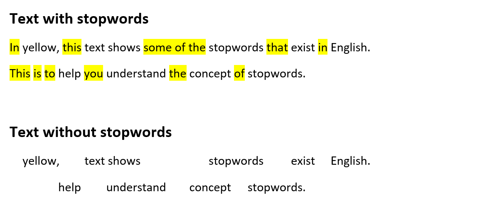
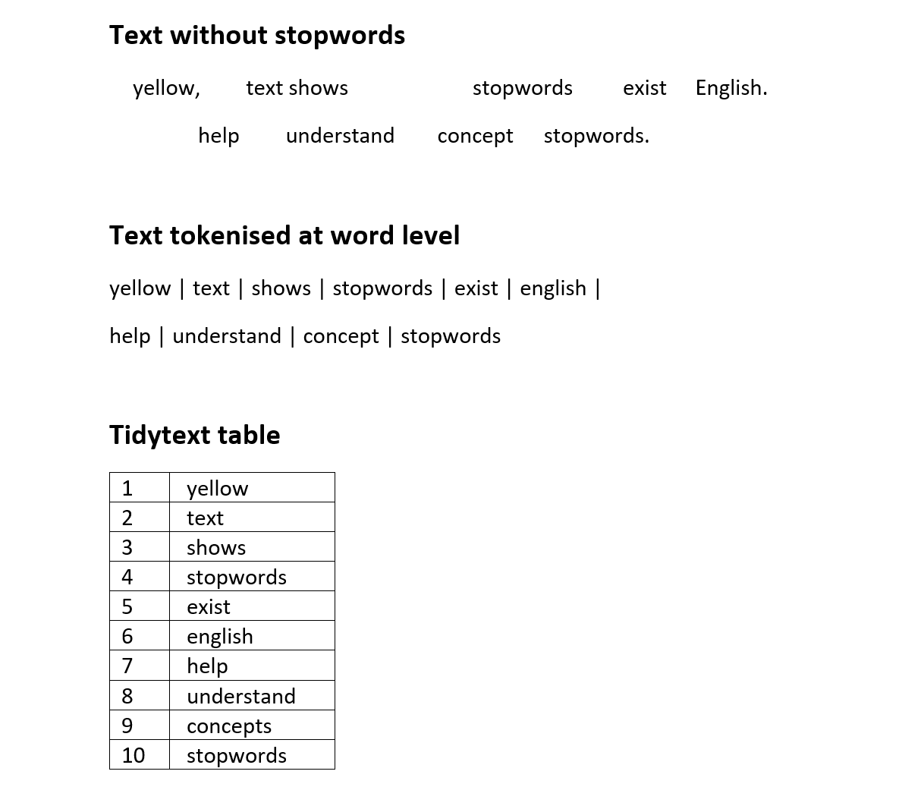

:::::::::::::::::::::::::::::::::::::: questions

- What is text mining?
- What are stop words?
- What is tokenisation?
- What is tidytext?

::::::::::::::::::::::::::::::::::::::::::::::::

::::::::::::::::::::::::::::::::::::: objectives

- Explain what text mining is
- Explain what stop words are
- Explain what tokenisation is
- Explain what tidytext is

::::::::::::::::::::::::::::::::::::::::::::::::

## What is text mining?
Text mining is the process of extracting meaningful information and knowledge from text. Text mining tools and methods allow the user to analyse large bodies of texts and to visualise the results.

By applying text mining principles to to a body of text you can gain insights that would otherwise be impossible to detect with the naked eye.

Before carrying out your analysis, the text must be transformed so that it can be read by a machine.

## Stopwords
Text often contains words that hold no particular meaning. These are called stop words and they are found throughout the text. Since stop words rarely contribute to the understanding of the text, it is a good idea to remove them before analysing the text.

:::: callout

### Example of removing stopwords

::::::

## Tidytext and tokenisation

In the following we will be making the text machine-readable by means of the tidy text principles. 

:::: callout

### Tidy text

The tidy text princples were developed by Silge and Robinson (reference tilføjes - https://www.tidytextmining.com) and apply the principles from the _tidy data_ on text.

The tidy data framework principles are:

* Each variable forms a column.
* Each observation forms a row.
* Each type of observational unit forms a table.

Applying these principles to text data leads to a format that is easily manipulated, visualised, and analysed using standard data science tools.

::::::

Tidy text represents the text by breaking it down into smaller parts such as sentences, words and letters. This process is called tokenisation.

Tokenisation is language independent, as long as the language uses space between each word.

Here is an example of tokenisation at word-level.

:::: callout

### Example of tokenization

::::::

::::::::::::::::::::::::::::::::::::: keypoints 

- Know what text mining is
- Know what stop words are
- Knowledge of the data we are working with
- Know what tidy text means

::::::::::::::::::::::::::::::::::::::::::::::::
