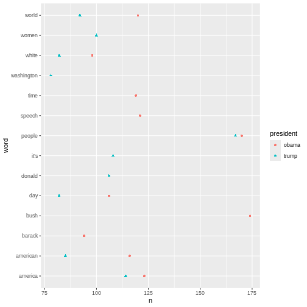
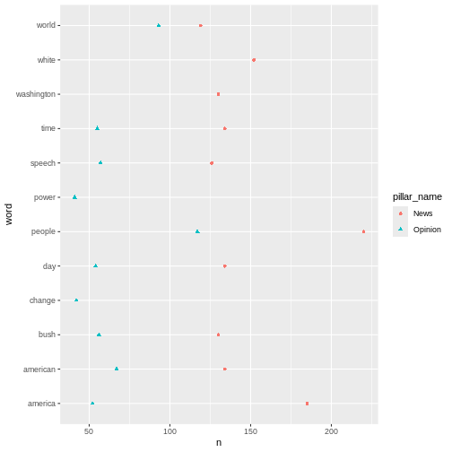

:::::::::::::::::::::::::::::::::::::: questions 

- How is a frequency analysis conducted?

::::::::::::::::::::::::::::::::::::::::::::::::

::::::::::::::::::::::::::::::::::::: objectives

- Learn how to find frequent words
- Learn how to analyse and visualise it


::::::::::::::::::::::::::::::::::::::::::::::::


## Frequency analysis

A word frequency is a relatively simple analysis. It measures how often words occur in a text. 


``` r
articles_anti_join %>% 
  count(word, sort = TRUE)
```

``` output
# A tibble: 12,328 × 2
   word             n
   <chr>        <int>
 1 obama          513
 2 trump          479
 3 president      450
 4 people         337
 5 inauguration   249
 6 america        237
 7 world          212
 8 american       201
 9 time           189
10 day            188
# ℹ 12,318 more rows
```

The previous code chunk resulted in a list containing the most frequent words. The words are from articles about both presidents, and they are sorted based on frequency with the highest number on top.

A closer look at the list may reveal that some words are irrelevant. Given that the articles in the dataset are about the two presidents' respective inaugurations, we consider the words below irrelevant for our analysis. Therefore, we make a new dataset without these words.


``` r
articles_filtered <- articles_anti_join %>%
  filter(!word %in% c("trump", "trump’s", "obama", "obama's", "inauguration", "president"))

articles_filtered %>% 
  count(word, sort = TRUE)
```

``` output
# A tibble: 12,322 × 2
   word           n
   <chr>      <int>
 1 people       337
 2 america      237
 3 world        212
 4 american     201
 5 time         189
 6 day          188
 7 bush         186
 8 speech       183
 9 white        180
10 washington   150
# ℹ 12,312 more rows
```
The words deemed irrelevant are no longer on the list above.

Instead of a general list it may be more interesting to focus on the most frequent words belonging to articles about the two presidents respectively.


``` r
articles_filtered %>%
  count(president, word, sort = TRUE)
```

``` output
# A tibble: 15,989 × 3
   president word         n
   <chr>     <chr>    <int>
 1 obama     bush       174
 2 obama     people     170
 3 trump     people     167
 4 obama     america    123
 5 obama     speech     121
 6 obama     world      120
 7 obama     time       119
 8 obama     american   116
 9 trump     america    114
10 trump     it’s       108
# ℹ 15,979 more rows
```
It can be a bit tricky to keep an overview of the words associated with each president. For instance, the word "people" is associated with both presidents. This is easy to see, as the two words are right next to each other. America, however, are further apart, although this word is also associated with both presidents. A visualisation may solve this problem.


``` r
articles_filtered %>%
  count(president, word, sort = TRUE) %>% 
  group_by(president) %>%
  slice(1:10) %>% 
  ggplot(mapping = aes(x = n, y = word, colour = president, shape = president)) +
  geom_point() 
```


The plot above shows the top-ten words associated Obamma and Trump respectively. If a word features on both presidents' top-ten list, it only occurs once in the plot. This is why the plot doesn't contain 20 words in total.

Another interesting aspect to look at would be the most frequent words used in relation to each president. In this analysis the president is the guiding principle.


``` r
articles_filtered %>%
  count(president, word, sort = TRUE) %>% 
  pivot_wider(
    names_from = president,
    values_from = n
  )
```

``` output
# A tibble: 12,322 × 3
   word     obama trump
   <chr>    <int> <int>
 1 bush       174    12
 2 people     170   167
 3 america    123   114
 4 speech     121    62
 5 world      120    92
 6 time       119    70
 7 american   116    85
 8 it’s        NA   108
 9 day        106    82
10 donald       1   106
# ℹ 12,312 more rows
```


``` r
articles_filtered %>%
  group_by(president) %>% 
  count(word, sort = TRUE) %>% 
  top_n(10) %>% 
  ungroup() %>% 
  mutate(word = reorder_within(word, n, president)) %>% 
  ggplot(aes(n, word, fill = president)) +
  geom_col() +
  facet_wrap(~president, scales = "free") +
  scale_y_reordered() + 
  labs(x = "word occurrences")
```

``` output
Selecting by n
```


The analyses just made can easily be adjusted. For instance, if we want look at the words by `pillar_name` instead of by `president`, we simply replace `president` with `pillar_name` in the code.


``` r
articles_filtered %>%
  count(pillar_name, word, sort = TRUE) %>% 
  group_by(pillar_name) %>%
  slice(1:10) %>% 
  ggplot(mapping = aes(x = n, y = word, colour = pillar_name, shape = pillar_name)) +
  geom_point() 
```




::::::::::::::::::::::::::::::::::::: keypoints 

- Making a frequency analysis
- Visualising the results


::::::::::::::::::::::::::::::::::::::::::::::::
