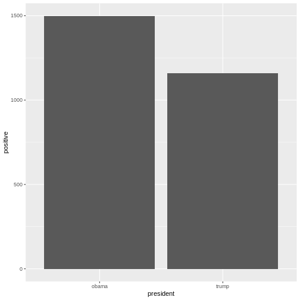

:::::::::::::::::::::::::::::::::::::: questions 

- "More resources"

::::::::::::::::::::::::::::::::::::::::::::::::

::::::::::::::::::::::::::::::::::::: objectives

- "Learning about extra tools that can aid your text mining journey"


::::::::::::::::::::::::::::::::::::::::::::::::


## Sentiment analysis
Sentiment analysis is a method for measuring the sentiment of a text. When humans read a text they can easily find the sentiment of a paragraph or text based on the meaning of the combined written words.

A machine does not have the same abilities, so instead of having it read the text, we look at the combined words of the text and look at the sentiment of each word and the sentiment of the text/paragraph would be the sum of the sentiments of the words.

In the previous section we had a list of words in the text without stopwords. To do a sentiment analysis we can use a so-called lexicon and assign a sentiment to each word. In order to do this we need an list of words and their sentiment. A simple form would be wether they are positive or negative.

There are multiple sentiment lexicons. For a start we will be using the `bing` lexicon. This lexicon categorises words as either positive or negative.


``` r
get_sentiments("bing")
```

``` output
# A tibble: 6,786 × 2
   word        sentiment
   <chr>       <chr>    
 1 2-faces     negative 
 2 abnormal    negative 
 3 abolish     negative 
 4 abominable  negative 
 5 abominably  negative 
 6 abominate   negative 
 7 abomination negative 
 8 abort       negative 
 9 aborted     negative 
10 aborts      negative 
# ℹ 6,776 more rows
```

To be able to use the `bing`-lexicon, we have to save it.


``` r
bing <- get_sentiments("bing")
```


``` r
articles_filtered %>% 
  inner_join(bing) 
```

``` output
Joining with `by = join_by(word)`
```

``` warning
Warning in inner_join(., bing): Detected an unexpected many-to-many relationship between `x` and `y`.
ℹ Row 48882 of `x` matches multiple rows in `y`.
ℹ Row 2233 of `y` matches multiple rows in `x`.
ℹ If a many-to-many relationship is expected, set `relationship =
  "many-to-many"` to silence this warning.
```

``` output
# A tibble: 6,159 × 6
      id president web_publication_date pillar_name word          sentiment
   <dbl> <chr>     <dttm>               <chr>       <chr>         <chr>    
 1     1 obama     2009-01-20 19:16:38  News        promises      positive 
 2     1 obama     2009-01-20 19:16:38  News        promise       positive 
 3     1 obama     2009-01-20 19:16:38  News        dust          negative 
 4     1 obama     2009-01-20 19:16:38  News        cold          negative 
 5     1 obama     2009-01-20 19:16:38  News        dawn          positive 
 6     1 obama     2009-01-20 19:16:38  News        celebrate     positive 
 7     1 obama     2009-01-20 19:16:38  News        inspirational positive 
 8     1 obama     2009-01-20 19:16:38  News        failed        negative 
 9     1 obama     2009-01-20 19:16:38  News        resound       positive 
10     1 obama     2009-01-20 19:16:38  News        attacks       negative 
# ℹ 6,149 more rows
```


``` r
articles_filtered %>% 
  inner_join(bing) %>% 
  count(word, sentiment, president, sort = TRUE) %>% 
  ungroup() %>% 
  group_by(sentiment, president) %>% 
  slice_max(n, n = 10) %>% 
  ungroup() %>% 
  mutate(word = reorder(word, n)) %>% 
  ggplot(mapping = aes(n, word, fill = sentiment)) +
  geom_col(show.legend = FALSE) +
  facet_grid(president~sentiment, scales = "free") +
  labs(x = "Contribution to sentiment", 
       y = NULL)
```

``` output
Joining with `by = join_by(word)`
```

``` warning
Warning in inner_join(., bing): Detected an unexpected many-to-many relationship between `x` and `y`.
ℹ Row 48882 of `x` matches multiple rows in `y`.
ℹ Row 2233 of `y` matches multiple rows in `x`.
ℹ If a many-to-many relationship is expected, set `relationship =
  "many-to-many"` to silence this warning.
```


``` r
# 
# articles_filtered %>% 
#   inner_join(bing) %>% 
#   group_by(president, sentiment) %>% 
#   count(word, sort = TRUE) %>% 
#   slice_max(n, n = 10) %>% 
#   ggplot(mapping = aes(x = n, y = word)) +
#   geom_col() +
#   facet_grid(sentiment~president)
```


``` r
articles_filtered %>% 
  inner_join(bing) %>% 
  group_by(president) %>% 
  summarise(positive = sum(sentiment == "positive"),
            negative = sum(sentiment == "negative")) %>% 
  ggplot(mapping = aes(x = president, y = positive)) +
  geom_col()
```

``` output
Joining with `by = join_by(word)`
```

``` warning
Warning in inner_join(., bing): Detected an unexpected many-to-many relationship between `x` and `y`.
ℹ Row 48882 of `x` matches multiple rows in `y`.
ℹ Row 2233 of `y` matches multiple rows in `x`.
ℹ If a many-to-many relationship is expected, set `relationship =
  "many-to-many"` to silence this warning.
```




``` r
download.file("https://raw.githubusercontent.com/KUBDatalab/R-textmining/main/data/AFINN_dansk.csv", "data/AFINN_dansk.csv", mode = "wb")
```

Now we read need to read the AFINN Index into a tibble and rename the columns


``` r
AFINN_dansk <- read_csv("data/AFINN_dansk.csv")
```

## Bringing it all together: joins
We have now created tibbles, each with the words appropriate for removal of stopwords and application of sentiment analysis respectively. Now we need to bring them together in the correct order, and we do this by using join-functions. The join functions from the tidyverse library allow tibbles to be joined together based on columns that have cells where the content is the same in both tibbles.

There are fundamentally 2 types of joins:
* Mutating joins (which add columns)
* Filtering joins (which filter away rows)

Mutating joins work by adding new columns to the tibble. We will use left_join, which is the most common of the mutating joins

The left_join joins all AFINN sentiment values to those rows that contain a word that is in the AFINN Index and adds it as a new column to the tibble. In the new column, the rows that contain words that don't appear in the AFINN Index have NA in their cell

Filtering joins work by filtering away some rows in the tibble. We will use the anti_join, which removes those rows that contain a word that is also in the stopword list


For more info on joins see [R for Data Science section section 13: Relational data](https://r4ds.had.co.nz/relational-data.html)

We will use the anti_join first, beause we need to filter away stopwords before we analyse the text with sentiment analysis


``` r
kina_tidy_2 <- kina_tidy %>% 
  anti_join(stopwords_dansk, by = "word") %>% #stopwords in Danish
  left_join(AFINN_dansk, by = "word") #left join with AFINN Index in Danish
```

``` error
Error: object 'kina_tidy' not found
```

## Analyzing the sentiment of parties
We would like to measure the sentiment of each party when giving speeches on the topic of China

First we need to calculate the mean sentiment value for each party. We save it as an object so that we can easily recall it for visualization


``` r
kina_sentiment_value <- kina_tidy_2 %>% 
  filter(Role != "formand") %>% 
  group_by(Party) %>% 
  summarize(
    mean_sentiment_value = mean(sentiment_value, na.rm=TRUE)
  )
```

``` error
Error: object 'kina_tidy_2' not found
```

Now we want to visualize each party's mean sentiment value according to the AFINN-Index


``` r
kina_sentiment_value %>% 
  ggplot(aes(x = Party, y = mean_sentiment_value, fill = Party)) + 
  geom_col() +
  labs(x= "Party")
```

``` error
Error: object 'kina_sentiment_value' not found
```

## Analyzing the sentiment of rød and blå blok
We would also like to analyze the sentiment of rød and blå blok as a whole respectively. To do this, we need to add a column to each row that specifies whether the word comes from a member of a party in rød blok or blå blok. We must therefore first define which parties make up rød and blå blok and put that in a tibble, then bind the two tibbles into one tibble, and then make a left_join to the rows in our tidy text


``` r
roed_blok <- tibble(Party = c("ALT", "EL", "SF", "S", "RV"), Blok = c("roed_blok"))
blaa_blok <- tibble(Party = c("V", "KF", "LA", "DF"), Blok = c("blaa_blok"))
blok <- bind_rows(roed_blok, blaa_blok)
kina_tidy_blokke <- kina_sentiment_value %>% 
  left_join(blok, by = "Party")
```

``` error
Error: object 'kina_sentiment_value' not found
```

Now we would like to do the same analysis of mean sentiment value, this time for each blok. We also want to specify that the column for roed_bloek should be red and the column for blaa_blok should be blue


``` r
kina_blokke_sentiment_value <- kina_tidy_blokke %>% 
  group_by(Blok) %>% 
  summarize(
    mean_sentiment_value = mean(mean_sentiment_value, na.rm=TRUE)
  )
```

``` error
Error: object 'kina_tidy_blokke' not found
```


``` r
kina_blokke_sentiment_value %>% 
  ggplot(aes(x = Blok, y = mean_sentiment_value, fill = Blok)) + 
  geom_col() +
  scale_fill_manual(values = c("blue", "red")) +
  labs(x= "Blok")
```

``` error
Error: object 'kina_blokke_sentiment_value' not found
```


## Stopwords for other languages
Stopword lists are available for a range of European languages via the tm library. See documentation on [https://cran.r-project.org/web/packages/tm/tm.pdf p. 38](https://cran.r-project.org/web/packages/tm/tm.pdf p. 38)

To call the stopword list for a certain language and make it a tibble to easily `anti_join` with your tidy text run the following code and insert the name of the language if a stopword list exists for it

``` r
stopwords_your_chosen_language <- as_tibble(stopwords(kind = "yourchosenlanguage"))
```

## Stemming as Natural Language Processing
One data preparation technology that we didn't use in this course is stemming. Stemming takes the inflectional morphological endings typically found at the end of words in Indo-European and Uralic languages and removes them, so that you don't need to put all potential morphological endings in a stopword list to catch all instances of a word. This is especially useful in languages with lots of verb conjugations and noun declensions like the Romance languages and the Slavic languages. BE AWARE that many Danish and English sentiment indexes don't work on stemmed words but take the limited morphological variation in these languages into account. As a rule of thumb, if you want to do sentiment analysis for a Danish or English text, then you are best of with not using stemming

It is possible to stem in a variety of European languages using the Porter-stemmer via the library SnowballC. 
Start by getting of list of which languages the stemmer can handle

``` r
install.packages("SnowballC")
library(SnowballC)
getStemLanguages()
```

Use stemming on the column with text in your tibble

``` r
tibble$stemmed_text <- wordStem(tibble$column_with_text, language = "name of the language")
```


## How to download the full dataset
Go to [https://repository.clarin.dk/repository/xmlui/handle/20.500.12115/44](https://repository.clarin.dk/repository/xmlui/handle/20.500.12115/44) and click the blue button that says: Download all files in item. This will download all approximately 860 files in Zip folder. 
The Zip folder contains zip folders for each year in the dataset, and these zip folders contain the parliament speeches including the metadata that describe them as .txt files.
You need to create a new folder somewhere outside the zip folder environment.
Now you must copy-paste all .txt files to that new folder. You can go into each zip-folder, press Ctrl+a to mark all files, and then press Ctrl+c to copy them. Go to the new folder and press Ctrl+v

To import the files into R as one tibble, you must first set the working directory to your new folder. Then run the following code:

``` r
files <- dir(pattern = "*.txt")

data <- files %>% 
  map(read_delim) %>% 
  reduce(rbind)
```

This may take up to 10 minutes. Once you have read all the files in as one tibble, you want to make it into one new file, so that you can quickly load the whole dataset in next time. Run the following code to write the file but insert the place on the C drive via the tabulator-function and finish the string with the name of your new file and put .txt after the filename:

``` r
write_delim(data, "C:/Users/yourusername/Desktop/Folder/Folketinget/filename.txt")
```

Now you can quickly load it in next time by using `read_delim`. Use `filter` to filter your dataset however you like it. For more info on the `filter` function, see [https://r4ds.had.co.nz/transform.html](https://r4ds.had.co.nz/transform.html) section 2

## Reading other types of files
You can also use `read_csv` to read .csv files in the same manner that you read .txt files

## Recommended materials
I highly recommend the book Text Mining with R: A Tidy Approach, which is openly available at [https://www.tidytextmining.com/](https://www.tidytextmining.com/)
There you can learn more advanced analyses as well as see the application of this course's methods to different datasets

## References
Hvitfeldt, E., & Silge, J. (2021). Supervised Machine Learning for Text Analysis in R (1st ed.). Chapman and Hall/CRC. https://doi.org/10.1201/9781003093459

David Robinson, & Julia Silge. (2017). Text Mining with R. O’Reilly Media, Inc.


::::::::::::::::::::::::::::::::::::: keypoints 

- "Stemming can be useful for Natural Language Processing; Stopword lists are available for many languages"

::::::::::::::::::::::::::::::::::::::::::::::::
