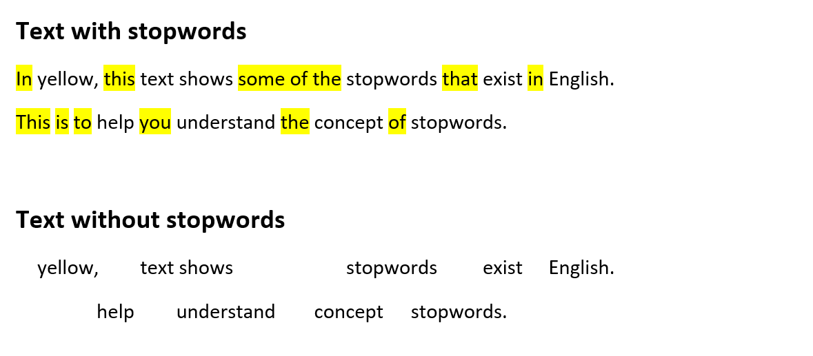

:::::::::::::::::::::::::::::::::::::: questions 

- What is text mining?
- What is tidy text?
- What is stop words?
- What is tokenisation?

::::::::::::::::::::::::::::::::::::::::::::::::

::::::::::::::::::::::::::::::::::::: objectives

- Explain what text mining is
- Explain what tidy text is
- Explain what stop words is
- Explain what tokenisation is

::::::::::::::::::::::::::::::::::::::::::::::::

## What is text mining?
Text mining is the process of extracting useful information and knowledge from text. Text mining tools allow the user to analyse large samples of texts and visualise the results.

Through these analyses you can gain insights into a collection of text 
to large to read with the naked eye.

Before you can carry out your analysis the text need to be transformed into a form that makes it easier to work with for a machine.

## Stopwords
Text often contains words that hold no particular meaning. These are called stop words and are found throughout the text. Since stop words rarely contribute to the understanding of the text, it is a good idea to remove them before analysing the text.

:::: callout

### Example of removing stopwords

::::::

## Tidytext and tokenisation
To be able to analyse a text it needs to be machine-readable. In this course we will follow the concepts of tidytext. 

:::: callout

### Tidy text

The tidy text concept is developed by Silge and Robinson (reference tilføjes - https://www.tidytextmining.com) and applies the principles from the tidy data to text.

The tidy data framework, principles are:

* Each variable forms a column.
* Each observation forms a row.
* Each type of observational unit forms a table.

Applying these principles to text data leads to a format that is easily manipulated, visualised, and analysed using standard data science tools.

::::::

Tidytext represents the text by breaking it down into smaller pieces, such as sentences, words and letters. This process is called tokenisation.

Tokenisation is language  independent, as long as the language uses spaces between words.

Here is an example of tokenisation on word-level.

:::: callout

### Example of tokenization

Hvitfeldt & Silge, 2021

(bør man også vise tabel-resultatet)

::::::

::::::::::::::::::::::::::::::::::::: keypoints 

- Know what text mining is
- Know what tidy text is
- Know what stop words is
- What data are we working with

::::::::::::::::::::::::::::::::::::::::::::::::
