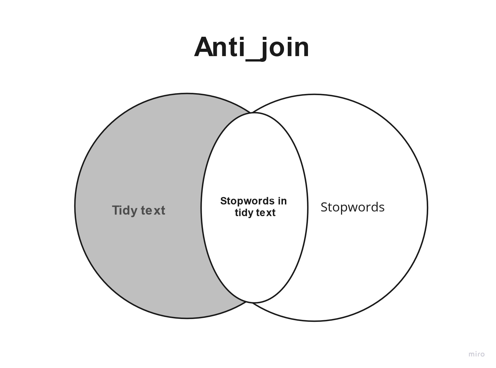

:::::::::::::::::::::::::::::::::::::: questions 

- How is text prepared for analysis?

::::::::::::::::::::::::::::::::::::::::::::::::

::::::::::::::::::::::::::::::::::::: objectives

- Be able to tokenise a text
- Be able to remove stopword from text

::::::::::::::::::::::::::::::::::::::::::::::::

```{r, include = FALSE}
library(tidyverse)
library(tidytext)
library(tm)
articles <- read_csv("data/articles.csv", na = c("NA", "NULL", ""))
```

## Tokenisation
Since we are working with text mining we focus on the `text` coloumn. We do this because the coloumn contains the text from articles.

To tokenise a coloumn, we use the functions `unnest_tokens()` from the `tidytext`-package. The function gets two arguments. The first one is `word`. This defines that the text should be split up by words. The second argument, `text`, defines the column that we want to tokenise.

```{r}
articles_tidy <- articles %>% 
  unnest_tokens(word, text)
```

:::: callout

### Tokenisation

The result is 118,269 rows. The reason is that the `text`-column is replaced by a new column named `word`. This columns contains all words found in all of the articles. The information from the remaining columns are kept. This makes is possible to dermine which article each word belongs to.

::::::

## Stopwords
The next step is to remove stopwords. We have chosen to use the stopword list from the package `tidytext`. The list contains 1,149 words that are considered stopwords. Other lists are available, and they differ in terms of how many words they contain.

```{r}
data(stop_words)
stop_words
```

::::::::::::::::::::::::::::::::::::::: discussion

### Adding and removing stopwords

You may find yourself in need of either adding or removing words from the stopwords list.

Here is how you add and remove stopwords to a predefined list.

::::::

:::::::::::::::: solution

### Add stopwords
First, create a tibble with the word you wish to add to the stop words list

```{r}
new_stop_words <- tibble(
  word = c("cat", "dog"),
  lexicon = "my_stopwords"
)
```

Then make a new stopwords tibble based on the original on, but with the new words added.

```{r}
updated_stop_words <- stop_words %>%
  bind_rows(new_stop_words)
```

Run the following code to see that the added lexicon `my_stopwords` contains two words.
```{r}
updated_stop_words %>% 
  count(lexicon)
```

:::::::::::::::

:::::::::::::::: solution

### Remove stopword
First,  create a vector with the word(s) you wish to remove from the stopwords list
 
```{r}
words_to_remove <- c("cat", "dog")
```

Then remove the rows containing the unwanted words.
```{r}
updated_stop_words <- stop_words %>%
  filter(!word %in% words_to_remove)
```

Run the following code to see that the added lexicon `my_stopwords` nolonger exists.
```{r}
updated_stop_words %>% 
  count(lexicon)
```

::::::::::::::::


In order to remove the stopwords from `articles_tidy`, we have to use the `anti_join`-function. 

```{r}
articles_anti_join <- articles_tidy %>% 
  anti_join(stop_words, by = "word")
```

With the ´anti_join´ function you have a dataset, in this case ´stop_words´, and the function removes the word from that dataset from you original dataset, in this case ´article_tidy´.




:::: callout

### `Join` and `anti_join`

There are multiple ways to join dataset in R. 


::::::

```{r, include = FALSE}
write_csv(articles_anti_join, "data/articles_anti_join.csv")
```

::::::::::::::::::::::::::::::::::::: keypoints 

- Know how to prepare text for analysis

::::::::::::::::::::::::::::::::::::::::::::::::
